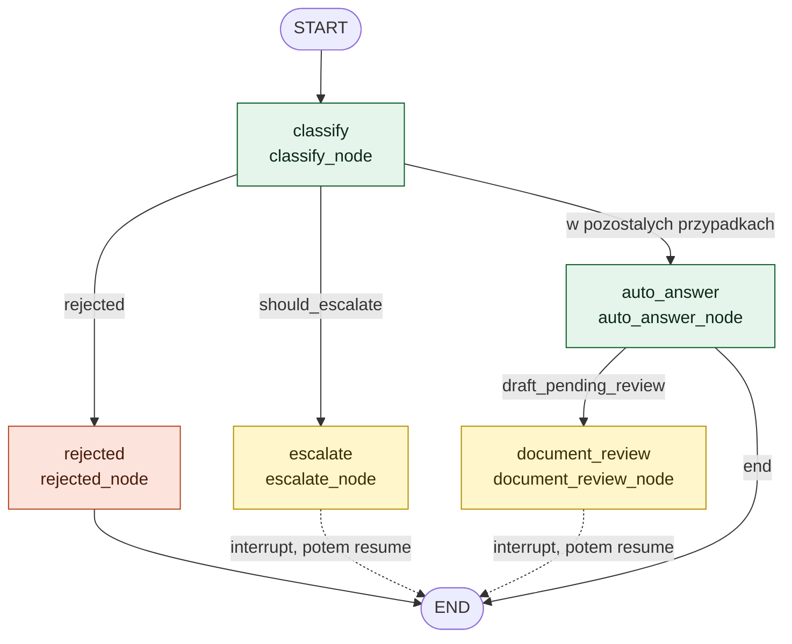

# Graf LangGraph — struktura faktyczna

Diagram odwzorowuje **kod, który jest w repo**:
[`src/multiagent_poc/graph/pipeline_graph.py`](../src/multiagent_poc/graph/pipeline_graph.py).
To nie jest diagram docelowy ani koncepcyjny — węzły i krawędzie odpowiadają
1:1 wywołaniom `add_node` / `add_conditional_edges` w funkcji `build_graph()`.

> Diagram **procesu docelowego** (kto z kim się komunikuje, łącznie z UI i
> Langfuse) to osobny dokument: [`sequence_diagram.md`](sequence_diagram.md).
> Ten opisuje wyłącznie topologię grafu wykonawczego.

Renderuje się natywnie na GitHubie.

## Topologia węzłów



**Legenda:** zielone — węzły wykonujące pracę; żółte — węzły, które **wstrzymują
graf** i czekają na człowieka; czerwony — odrzucenie bez wywołania LLM-a.
Linia przerywana oznacza, że przejście do `END` następuje dopiero po
wznowieniu grafu odpowiedzią człowieka.

## Węzły

| Węzeł | Funkcja | Co robi | Czy wywołuje LLM |
|---|---|---|---|
| `classify` | `classify_node` | Deleguje do `handle_question()` — walidacja → skan AV załącznika → parsowanie PDF → klasyfikacja → confidence gate. Wyjątki `ValidationRejected` / `AttachmentRejected` łapie i zamienia na `rejected=True`. | nie |
| `auto_answer` | `auto_answer_node` | Subagent odpowiada (`agents/subagent.py`), potem drafting agent tworzy dokument (`agents/drafting_agent.py`). Oba dostają `attachment_text`, jeśli był załącznik. | **tak, dwa razy** |
| `document_review` | `document_review_node` | `interrupt()` z payloadem `kind="document_review"` — czeka na zatwierdzenie/edycję dokumentu przez operatora. | nie |
| `escalate` | `escalate_node` | `interrupt()` z payloadem `kind="escalation"` — czeka na odpowiedź operatora. | nie |
| `rejected` | `rejected_node` | Zwraca komunikat odmowy z powodem z walidacji. | nie |

## Rozgałęzienia warunkowe

Graf ma dokładnie dwa punkty decyzyjne, oba jako `add_conditional_edges`:

**1. `route_after_classify`** — kolejność sprawdzania ma znaczenie:
```python
if state.get("rejected"):        return "rejected"    # walidacja/AV odrzuciły
if state.get("should_escalate"): return "escalate"    # gate: pewność < próg
return "auto_answer"                                  # pewność OK
```

**2. `route_after_auto_answer`** — czy dokument wymaga oczu człowieka:
```python
return "document_review" if state.get("draft_pending_review") else "end"
```

`draft_pending_review` ustawia drafting agent na podstawie
`DocumentSpec.requires_human_review` — `True` wyłącznie dla kategorii
wrażliwych (**BHP**, **HR**).

## Co wynika z tej topologii

- **Ścieżka odrzucenia i eskalacji nie kosztuje ani jednego wywołania LLM.**
  Pytanie z danymi wrażliwymi albo o zbyt niskiej pewności kończy się w
  sekundy, a nie po kilku minutach generowania.
- **Dokument powstaje tylko na ścieżce `auto_answer`.** Nie ma sensu generować
  pisma dla pytania, które i tak trafia do człowieka.
- **Dwa różne powody pauzy, jeden mechanizm.** `escalate` i `document_review`
  to osobne węzły, ale oba używają `interrupt()` i tej samej kolejki HITL —
  rozróżnia je pole `kind` w payloadzie.
- **Odpowiedź proceduralna przeżywa pauzę.** Przy `document_review` stan
  zawiera już `answer` z subagenta; po wznowieniu pracownik dostaje **i**
  odpowiedź, **i** zatwierdzony dokument.

## Pauza i wznowienie

Graf jest kompilowany z checkpointerem:

```python
return graph.compile(checkpointer=MemorySaver())
```

Każde wywołanie wymaga stałego `thread_id` w configu — to po nim checkpointer
odnajduje wstrzymany stan, gdy wraca odpowiedź człowieka:

```python
config = {"configurable": {"thread_id": thread_id}}
result = invoke_graph(graph, {"question": q}, config=config)   # → pauza
result = invoke_graph(graph, Command(resume=tekst), config=config)  # → wznowienie
```

`MemorySaver` trzyma stan w pamięci procesu — świadome uproszczenie PoC, nie
przetrwa restartu. W produkcji: checkpointer na Redis/Postgres.

## Observability

Cały graf jest wywoływany wyłącznie przez `invoke_graph()` — cienki wrapper z
dekoratorem `@observe(name="handle_user_turn")`. Dzięki temu jedno pytanie =
jeden trace w Langfuse, a wszystko wywołane pod spodem (walidacja,
klasyfikacja, gate, skan AV, obaj agenci) zagnieżdża się w nim automatycznie.
Przykładowe, realne trace'y — patrz [`case_study.md`](case_study.md).
