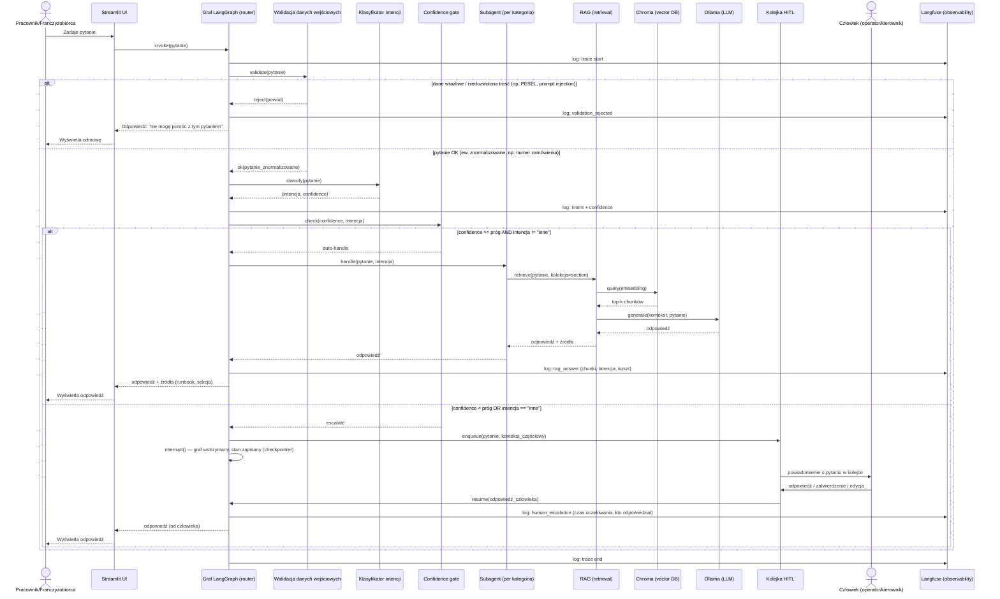

# Diagram sekwencji — docelowy proces

Pełny przepływ pytania użytkownika przez wszystkie 7 warstw architektury
(patrz [`architecture.md`](architecture.md)). To jest diagram **docelowy** —
opisuje, jak proces ma działać po ukończeniu Tygodni 3-4, nie stan obecny
(status implementacji per element — patrz [`requirements.md`](requirements.md)).

Renderuje się natywnie w GitHubie (blok ```mermaid).



## Uwagi do diagramu

- **Walidacja przed klasyfikacją, nie po** — świadoma decyzja: dane wrażliwe
  (PESEL, próby prompt injection — patrz pytania 16 i 20 w `test_questions.md`)
  mają być odrzucone zanim jakikolwiek fragment pytania trafi do klasyfikatora
  czy LLM-a, żeby nie ryzykować, że trafią do promptu czy logów Langfuse.
- **HITL to nie tylko "przejęcie rozmowy"** — węzeł `interrupt()` w LangGraph
  wstrzymuje graf i zapisuje stan przez checkpointer, więc człowiek może
  odpowiedzieć z opóźnieniem (nie synchronicznie), a graf wznawia się dokładnie
  tam, gdzie stanął. To różni się od prostego "jeśli nisko, to komunikat o
  eskalacji i koniec" — patrz decyzja o HITL w `decision_log.md`.
- **Observability (Langfuse) jest przekrojowe** — na diagramie pokazane jako
  osobne wywołania `log:`, ale docelowo to pojedynczy trace na całą rozmowę
  (nested spans), nie osobne requesty.
- Diagram nie pokazuje pętli powtórnego pytania przy niejednoznacznej
  intencji (dopytanie zamiast eskalacji) — do rozstrzygnięcia w Tygodniu 3
  razem z implementacją confidence gate.
